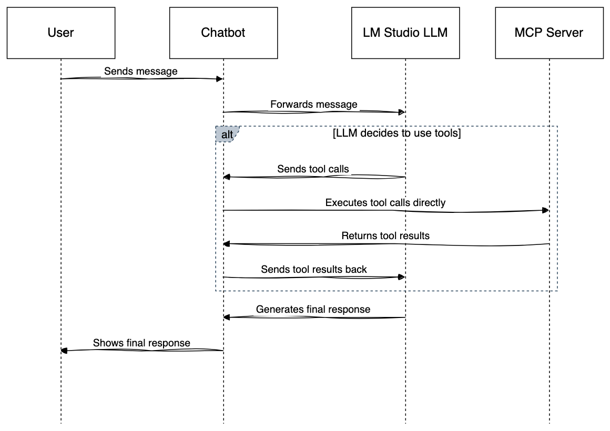

# SpringBoot MCP Server

A SpringBoot project that demonstrates the integration of Spring AI with a simple student management system, allowing AI models to interact with the application through tools.

## Overview

This is a demonstration of how to build a Spring Boot application that exposes its functionality as tools for AI models using the Model Context Protocol (MCP). The application provides a simple student management system with CRUD operations, and these operations are exposed as tools that can be called by AI models.

The project consists of two main components:
1. **Spring Boot Server**: A Java-based backend that manages student data and exposes operations as MCP tools.
2. **Python Chatbot**: A client that connects to the server and allows interaction with an LLM (Large Language Model) through LM Studio.

## Project Structure

### Core Components

- **Models**: Data structures used in the application
  - `Student`: Represents a student with id, name, email, age, and address
  - `Address`: Represents an address with pincode, city, and state
  - `Response`: Standard response format with success flag, message, and data

- **Services**: Business logic implementation
  - `StudentDetailsService`: Manages student data with in-memory storage
  - `StudentTools`: Exposes student operations as MCP tools

- **Configuration**: Application setup
  - `OpenApiConfig`: Configuration for API documentation
  - `McpServerApplication`: Main application class with Spring AI tool configuration

### Bot Directory

The `bot` directory contains a Python-based chatbot that interacts with the MCP server:

- **chatbot.py**: A comprehensive Python script that:
  - Connects to the MCP server via subprocess
  - Communicates with LM Studio for LLM integration
  - Provides both interactive and stdio modes for interaction
  - Formats responses for better readability
  - Handles tool calls between the LLM and MCP server

- **runme.sh**: Shell script to launch the chatbot with the correct parameters
  - Starts the MCP server in stdio mode
  - Configures the chatbot for interactive use

- **requirements.txt**: Lists Python dependencies for the chatbot
  - aiohttp: For asynchronous HTTP requests
  - asyncio-mqtt: For MQTT communication
  - sseclient-py: For Server-Sent Events



## Usage

### Running the Spring Boot Server

1. Build the project using Maven:
   ```
   mvn clean package
   ```

2. Run the server:
   ```
   java -jar target/mcp-server-0.0.1-SNAPSHOT.jar
   ```

The server will start on port 8081 by default.

### LM Studio Pre-requisites

Before using the chatbot, ensure that:
1. LM Studio is running in dev mode on port 1234
2. The LLM model `qwen/qwen2.5-vl-7b` is loaded in LM Studio

### Using the Chatbot

1. Install Python dependencies:
   ```
   cd bot
   pip install -r requirements.txt
   ```

2. Run the chatbot using the provided script:
   ```
   cd bot
   ./runme.sh
   ```

3. Interact with the chatbot in the terminal. You can:
   - Ask questions about students
   - Add new student records
   - Retrieve student information
   - Delete student records

### API Documentation

The application includes OpenAPI documentation, which can be accessed at:
```
http://localhost:8081/swagger-ui.html
```

### Available MCP Tools

The following tools are exposed through the MCP protocol:

- **LIST_ALL_STUDENT_RECORDS**: Returns a list of all student records
- **ADD_STUDENT_RECORD**: Adds a new student record
- **DELETE_STUDENT_RECORD**: Deletes a student record by ID
- **GET_STUDENT_RECORD**: Retrieves a student record by ID

## Technical Details

- **Java Version**: 24
- **Spring Boot Version**: 3.5.0
- **Spring AI Version**: 1.0.0
- **Data Storage**: In-memory (ConcurrentHashMap)
- **API Documentation**: OpenAPI 2.3.0

## Development

This project demonstrates how to:
1. Create a Spring Boot application with Spring AI integration
2. Expose application functionality as MCP tools
3. Build a Python client that connects to the MCP server
4. Integrate with LLMs through LM Studio

## License

This project is for demonstration purposes.

## Author

Sumit Gaur
